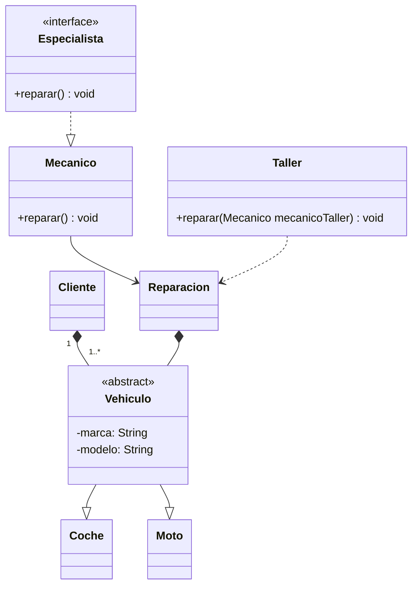

# DIAGRAMA DE CLASES - UML

```mermaid

classDiagram
direction TB
    class Vehiculo {
	    -marca: String
	    -modelo: String
    }

    class Coche {
    }

    class Moto {
    }

    class Cliente {
    }

    class Reparacion {
    }

    class Mecanico {
	    +reparar() void
    }

    class Taller {
	    +reparar(Mecanico mecanicoTaller) void
    }

    class Especialista {
	    +reparar() void
    }

	<<abstract>> Vehiculo
	<<interface>> Especialista

    Cliente "1" *-- "1..*" Vehiculo
    Reparacion *-- Vehiculo
    Especialista ..|> Mecanico
    Mecanico --> Reparacion
    Vehiculo --|> Coche
    Vehiculo --|> Moto
    Taller ..> Reparacion

```
