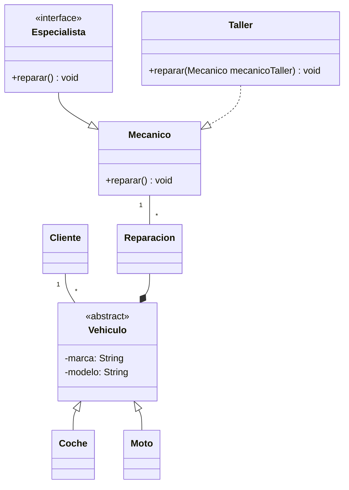

# DIAGRAMA DE CLASES - UML

```mermaid

classDiagram
direction TB
    class Vehiculo {
	    -marca: String
	    -modelo: String
    }

    class Coche {
    }

    class Moto {
    }

    class Cliente {
    }

    class Reparacion {
    }

    class Mecanico {
	    +reparar() void
    }

    class Taller {
	    +reparar(Mecanico mecanicoTaller) void
    }

    class Especialista {
	    +reparar() void
    }

	<<abstract>> Vehiculo
	<<interface>> Especialista

    Vehiculo <|-- Coche
    Vehiculo <|-- Moto
    Cliente "1" -- "*" Vehiculo
    Reparacion --* Vehiculo
    Especialista --|> Mecanico
    Taller ..|> Mecanico
    Mecanico "1" -- "*" Reparacion


```
